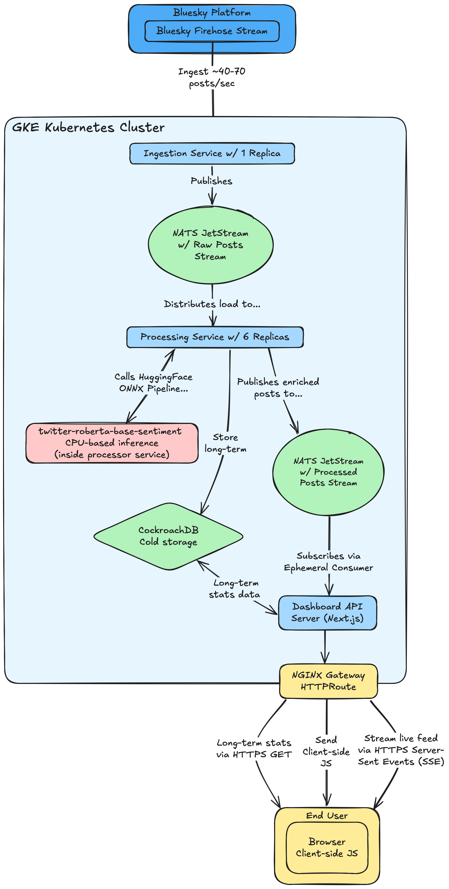

# NATS-Based Data Processing Pipeline

This project consists of a complete data processing pipeline using NATS JetStream for messaging between microservices, with support for both local Docker Compose deployment and cloud-native Kubernetes deployment on Google Kubernetes Engine (GKE).

> **Note:** This repository uses Git submodules. Clone with `git clone --recurse-submodules https://github.com/richardr1126/k8s-datacenter-project.git` or run `git submodule update --init --recursive` if already cloned. See [Submodule Repositories](#submodule-repositories) below for links to individual service repositories.

## Architecture



### Cloud Deployment (GKE)
The project includes a cost-optimized GKE cluster manager for production deployments:
- **Cluster Type**: Single zonal cluster (us-central1-b)
- **Node Pools**: 
  - Default Pool: t2d-standard-2 (2 vCPUs, 8GB RAM) for general workloads
  - ML Pool: n2d-highcpu-4 (4 vCPUs, 4GB RAM) for sentiment analysis workloads
- **Cost Optimization**: Spot instances (60-91% savings), private nodes with Cloud NAT
- **Estimated Cost**: ~$40-67/month with spot instances

## Services

1. **NATS Server**: Message broker with JetStream persistence
2. **NATS Firehose Ingest**: Ingests data from external sources into NATS streams
3. **NATS Stream Processor**: Processes messages with sentiment analysis
4. **Mock Ingest**: Generates test data for development
5. **Sentiment Web UI**: Real-time visualization dashboard (Next.js)

## Submodule Repositories

- [**bsky-sentiment-web**](https://github.com/richardr1126/bsky-sentiment-web) - Real-time visualization dashboard (Next.js)
- [**gke-cluster**](https://github.com/richardr1126/gke-cluster) - GKE cluster management and Helm charts
- [**nats-firehose-ingest**](https://github.com/richardr1126/nats-firehose-ingest) - Firehose data ingestion service
- [**nats-stream-processor**](https://github.com/richardr1126/nats-stream-processor) - Sentiment analysis processor

---

# LOCAL DEVELOPMENT

## Quick Start (Docker Compose)

### Run the complete pipeline:
```bash
docker compose up --build
```

### Run with mock data generation:
```bash
docker compose --profile mock up --build
```

### Run with debugging tools:
```bash
docker compose --profile tools up --build
```

### Run everything (full setup):
```bash
docker compose --profile mock --profile tools up --build
```

## Local Service Endpoints

- **NATS Server**: 
  - Client: `localhost:4222`
  - HTTP Monitoring: `localhost:8222`
  - Cluster: `localhost:6222`
- **Firehose Ingest**: `http://localhost:8081`
  - Health: `http://localhost:8081/health`
  - Metrics: `http://localhost:8081/metrics`
- **Stream Processor**: `http://localhost:8082`
  - Health: `http://localhost:8082/health`
  - Metrics: `http://localhost:8082/metrics`
- **Sentiment Web UI**: `http://localhost:3000`

## Local Monitoring and Debugging

### Check service health:
```bash
curl http://localhost:8081/health  # Firehose Ingest
curl http://localhost:8082/health  # Stream Processor
```

### View metrics:
```bash
curl http://localhost:8081/metrics  # Firehose Ingest metrics
curl http://localhost:8082/metrics  # Stream Processor metrics
```

### NATS monitoring:
- Web UI: http://localhost:8222
- CLI access: `docker compose exec nats-box nats`

### Interactive NATS debugging:
```bash
# Start with tools profile
docker compose --profile tools up -d

# Connect to NATS box
docker compose exec nats-box sh

# Inside the container, you can use NATS CLI:
nats stream list
nats stream info bluesky-posts-dev
nats stream info bluesky-posts-enriched-dev
nats sub "bluesky.posts.dev.>"
nats sub "bluesky.enriched.dev.>"
```

## Local Data Flow

1. **Mock Ingest** → publishes test messages to `bluesky-posts-dev` stream with subject `bluesky.posts.dev.*`
2. **Firehose Ingest** → consumes from external firehose and publishes to `bluesky-posts-dev` stream with subject `bluesky.posts.dev.*`
3. **Stream Processor** → consumes from `bluesky-posts-dev` stream, adds sentiment/topic analysis, publishes to `bluesky-posts-enriched-dev` stream with subject `bluesky.enriched.dev.*`
4. **Sentiment Web UI** → subscribes to enriched stream and displays real-time updates

## Local Development

### Individual service development:
Each service can still be developed independently using their local docker-compose files:

```bash
# Firehose Ingest only
cd nats-firehose-ingest
docker compose up --build

# Stream Processor only  
cd nats-stream-processor
docker compose up --build

# Sentiment Web UI only
cd bsky-sentiment-web
npm install
npm run dev
```

### Logs:
```bash
# View all logs
docker compose logs -f

# View specific service logs
docker compose logs -f nats-firehose-ingest
docker compose logs -f nats-stream-processor
docker compose logs -f mock-ingest
docker compose logs -f bsky-sentiment-web
```

### Cleanup:
```bash
# Stop all services
docker compose down

# Remove volumes (clears data)
docker compose down -v

# Remove images
docker compose down --rmi all
```

---

# CLOUD DEPLOYMENT (GKE)

## Prerequisites

1. **Install Google Cloud SDK and authenticate:**
   ```bash
   gcloud auth login
   gcloud auth application-default login
   gcloud config set project YOUR_PROJECT_ID
   ```

2. **Enable required APIs:**
   ```bash
   gcloud services enable container.googleapis.com compute.googleapis.com
   ```

3. **Install Python dependencies:**
   ```bash
   cd gke-cluster
   pip install -e .
   ```

## Create a GKE Cluster

```bash
cd gke-cluster

# Create cluster with default name and spot instances
python gke-cluster.py create

# Create cluster with custom name
python gke-cluster.py create --name my-cluster

# Create cluster without spot instances (more expensive but more reliable)
python gke-cluster.py create --no-spot
```

## Connect to Your Cluster

```bash
gcloud container clusters get-credentials cost-optimized-cluster \
  --zone us-central1-b --project YOUR_PROJECT_ID

# Verify nodes
kubectl get nodes

# Check node pools
kubectl get nodes --show-labels | grep pool
```

## Deploy Services with Helm

After your cluster is running, deploy the services using Helm charts:

### 1. Install K8s Helm Apps

```bash
cd gke-cluster/helm

# Run installation script
# 1. Installs cert-manager, NGINX Gateway Fabric, and cluster issuers
# 2. Installs kube-prometheus-stack w/ grafana for monitoring
# 3. Installs prometheus-adapter for custom metrics in K8s HPA
# 4. Installs NATS cluster with JetStream
# 5. Installs CockroachDB for persistent storage
./install-apps.sh
```

### 2. Create Secrets and Deploy Application Services

For each service, create secrets and deploy using Helm:

**Firehose Ingest:**
```bash
cd nats-firehose-ingest/charts
./create-secrets.sh

helm upgrade --install nats-firehose-ingest ./nats-firehose-ingest \
  --set image.tag=latest
```

**Stream Processor:**
```bash
cd nats-stream-processor/charts
./create-secrets.sh

helm upgrade --install nats-stream-processor ./nats-stream-processor \
  --set image.tag=latest
```

**Sentiment Web UI:**
```bash
cd bsky-sentiment-web/charts
./create-secrets.sh

helm upgrade --install bsky-sentiment-web ./bsky-sentiment-web \
  --set image.tag=latest
```

## Helm Commands Reference

```bash
# List all releases
helm list --all-namespaces

# Check release status
helm status nats-firehose-ingest --namespace default

# View release values
helm get values nats-firehose-ingest --namespace default

# Upgrade a release
helm upgrade nats-firehose-ingest ./nats-firehose-ingest \
  --namespace default \
  --values ./nats-firehose-ingest/values.yaml

# Rollback a release
helm rollback nats-firehose-ingest 1 --namespace default

# Uninstall a release
helm uninstall nats-firehose-ingest --namespace default

# Dry-run to see what would be deployed
helm upgrade --install nats-firehose-ingest ./nats-firehose-ingest \
  --namespace default \
  --dry-run --debug
```

## Create Secrets Script Options

The `create-secrets.sh` script supports several options:

```bash
# Basic usage (uses .env.prod by default)
bash create-secrets.sh

# Specify custom namespace
bash create-secrets.sh --namespace my-namespace

# Specify custom secret name
bash create-secrets.sh --secret-name my-secret

# Specify custom .env file
bash create-secrets.sh --env-file /path/to/.env

# Dry-run to see what would be created
bash create-secrets.sh --dry-run

# Combine options
bash create-secrets.sh \
  --namespace production \
  --secret-name app-secrets \
  --env-file .env.production \
  --dry-run
```

## Scale the Cluster

```bash
# Scale all pools to 5 nodes each
python gke-cluster.py scale --name cost-optimized-cluster --nodes 5

# Scale down to 0 nodes (save money, only pay for control plane)
python gke-cluster.py scale --nodes 0

# Scale specific pool only
python gke-cluster.py scale --name cost-optimized-cluster --nodes 3 --pool ml-pool
```

## Delete the Cluster

```bash
# Delete cluster and all associated resources (PVCs, Cloud NAT, Cloud Router)
python gke-cluster.py delete

# Delete specific cluster
python gke-cluster.py delete --name my-cluster
```

## List Clusters

```bash
python gke-cluster.py list
```

## Cloud Service Endpoints

Services are deployed via Helm charts in the `gke-cluster/helm/` directory:
- NATS cluster with JetStream
- Kube-Prometheus stack for monitoring
- CockroachDB for persistent storage
- Individual service deployments with auto-scaling

## Cloud Monitoring and Debugging

### Interactive NATS debugging:
```bash
# Connect to NATS box in the cluster
kubectl exec -it deployment/nats-box -n nats -- sh

# Inside the container, you can use NATS CLI:
nats stream list
nats stream info bluesky-posts
nats stream info bluesky-posts-enriched
nats sub "bluesky.posts.>"
nats sub "bluesky.enriched.>"
```

## Cloud Data Flow

1. **Mock Ingest** → publishes test messages to `bluesky-posts` stream with subject `bluesky.posts.*`
2. **Firehose Ingest** → consumes from external firehose and publishes to `bluesky-posts` stream with subject `bluesky.posts.*`
3. **Stream Processor** → consumes from `bluesky-posts` stream, adds sentiment/topic analysis, publishes to `bluesky-posts-enriched` stream with subject `bluesky.enriched.*`
4. **Sentiment Web UI** → subscribes to enriched stream and displays real-time updates

## GKE Cluster Details

### Node Pools

#### Default Pool
- **Machine Type**: t2d-standard-2 (2 vCPUs, 8GB RAM)
- **Purpose**: General workloads
- **Disk**: 20GB standard persistent disk
- **Autoscaling**: Manual (use scale command)

#### ML Pool
- **Machine Type**: n2d-highcpu-4 (4 vCPUs, 4GB RAM)
- **Purpose**: ML inference workloads (optimized for ONNX INT8 models)
- **Disk**: 50GB standard persistent disk
- **Taint**: `dedicated=ml:NoSchedule`
- **Autoscaling**: Enabled (0-6 nodes)

To deploy to ML pool, add toleration and node selector:
```yaml
tolerations:
- key: "dedicated"
  operator: "Equal"
  value: "ml"
  effect: "NoSchedule"
nodeSelector:
  cloud.google.com/gke-nodepool: ml-pool
```

### Private Nodes & Cloud NAT

The cluster uses **private nodes** to save on external IP quota:

- **Private Nodes**: Nodes only have private IPs (no external IPs)
- **Cloud NAT**: Provides outbound internet access for:
  - Pulling container images
  - Accessing external APIs
  - Downloading packages
- **Security**: Nodes are unreachable from the internet
- **Cost**: Adds ~$1-5/month for NAT

**Benefits:**
- ✅ No external IP quota needed (only LoadBalancer needs 1 external IP)
- ✅ Reduced attack surface
- ✅ All outbound traffic through NAT gateway
- ✅ Can scale to 9 nodes without external IP quota issues

### Cost Optimization Features

#### Spot Instances
- **Savings**: 60-91% off regular instance prices
- **Trade-off**: Can be terminated with 30-second notice
- **Best for**: Development, testing, fault-tolerant workloads

#### Machine Type Selection
- **Default Pool (t2d-standard-2)**: 2 vCPUs, 8GB RAM
- **ML Pool (n2d-highcpu-4)**: 4 vCPUs, 4GB RAM (compute-optimized)
- **Total capacity**: 18 vCPUs, 48GB RAM at full scale (3+6 nodes)

#### Storage Optimization
- **Standard Persistent Disk**: Cheapest disk option
- **Sizes**: 20GB default, 50GB for ML nodes
- **Performance**: Suitable for most development workloads

#### Automatic Cleanup
- **PVC Disks**: Automatically deleted with cluster
- **Cloud NAT**: Automatically removed with cluster
- **No Orphaned Resources**: All resources cleaned up on delete

## Cost Estimation

### Monthly costs (approximate, spot instances):
- Default Pool (3 x t2d-standard-2): ~$20-33
- ML Pool (3 x n2d-highcpu-4): ~$15-25
- Persistent Disk (100GB standard): ~$4
- Cloud NAT: ~$1-5
- **Total: ~$40-67/month**

### Cost when scaled to 0 nodes:
- Control plane: Free (single zonal cluster)
- Cloud NAT: ~$1/month (minimal with no traffic)
- **Total: ~$1/month**

*Prices may vary by region and are subject to change. Spot instance pricing is typically 60-91% less than regular instances.*

---

# MESSAGE FORMATS

### Input Message (to sentiment processor):
```json
{
  "uri": "at://test/12345",
  "text": "This is a great day!",
  "author": "test-user-67890",
  "timestamp": "2025-09-30T10:30:00Z"
}
```

### Output Message (from sentiment processor):
```json
{
  "uri": "at://test/12345",
  "text": "This is a great day!",
  "author": "test-user-67890",
  "timestamp": "2025-09-30T10:30:00Z",
  "sentiment": {
    "label": "POSITIVE",
    "score": 0.9234
  },
  "processed_at": "2025-09-30T10:30:01Z"
}
```

---

# TROUBLESHOOTING

## Local Development Issues

1. **Services not connecting to NATS**: Check that NATS is healthy before dependent services start
2. **Port conflicts**: The unified compose uses different ports (8081, 8082) to avoid conflicts
3. **Model download**: Stream processor downloads AI models on first run, which may take time
4. **Memory usage**: Sentiment analysis requires adequate memory allocation

## GKE Deployment Issues

1. **Authentication Issues**:
   ```bash
   gcloud auth application-default login
   gcloud config set project YOUR_PROJECT_ID
   ```

2. **API Not Enabled**:
   ```bash
   gcloud services enable container.googleapis.com compute.googleapis.com
   ```

3. **Cluster not accessible**: Verify private cluster configuration and Cloud NAT setup

---

# PROJECT STRUCTURE

```
.
├── README.md                          # This file
├── architecture.excalidraw.png        # Architecture diagram
├── docker-compose.yml                 # Local development orchestration
├── gke-cluster/                       # GKE cluster management
│   ├── gke-cluster.py                # Cluster creation/management script
│   ├── README.md                      # GKE-specific documentation
│   ├── pyproject.toml                # Python dependencies
│   └── helm/                          # Kubernetes Helm charts
├── nats-firehose-ingest/             # Firehose data ingestion service
├── nats-stream-processor/            # Sentiment analysis processor
├── nats-stream-processor-topics/     # Topic classification processor
└── bsky-sentiment-web/               # Real-time visualization dashboard
```

---

# SECURITY BEST PRACTICES

The GKE cluster includes several security optimizations:
- Private nodes (no direct internet access to nodes)
- Cloud NAT for controlled outbound access
- Workload Identity for secure service access
- Container-Optimized OS (COS_CONTAINERD)
- Uses GKE defaults for RBAC and security policies
- Latest Kubernetes version
- Cost management enabled for usage tracking
</content>
<parameter name="line_count">
651
